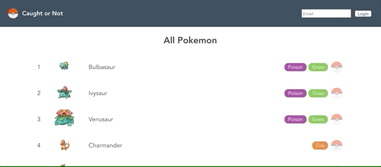

# Caught or Not

I built this little app as an example project for a lunch and learn I did on Vue + GraphQL + Apollo.

The backend is built with Apollo Server and the frontend uses Vue and Apollo Client to query the GraphQL server.

It uses the lovely [PokéAPI](https://pokeapi.co/) as a datasource for Pokémon data and uses mutations to login users and persist per-user state (caught, or not) to a local SQLite database.

## Fancy GIF



## Usage

You'll need to run the client and the server as follows.

### Client

```shell
cd client
yarn install
yarn serve
```

### Server

```shell
cd server
yarn install
yarn start
```